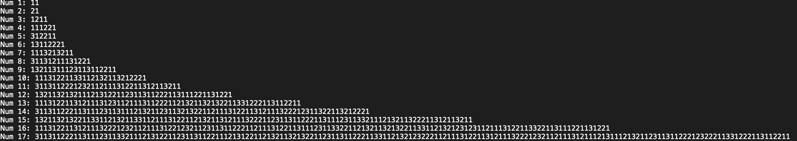

# Look-and-say Sequence
One day during a car ride, my dad asked me a puzzle: *What comes next in the sequence 1, 11, 21, 1211, 111221?* Well, I had seen the puzzle, so I knew what came next. If you're still wondering how the sequence works, here's how:  
```
  1 has one 1 so the next number is 11.  
  11 has two 1's so the next number is 21.  
  21 has one 2 and one 1 so the next number is 1211.  
  1211 has one 1 followed by one 2 and two 1's, so you get 111221.   
```
By following this iteration, the answer to the puzzle will be 312211.


Since I had nothing to do in the car, I kept working on this joyfully silly puzzle by writing down more numbers in the sequence on a piece of paper. But I quickly realized if I kept on doing this repetitive task, I would run out of paper very soon. This made me think about how the sequence would evolve. In other words, would it keep growing forever or would it decrease at some point?

<!--
some initial observations
 - some number never go up or down: 22 goes to itself
 - some cases it can decrease 
 - but eventually will rebound

number crunching to see if there is a pattern
 - made python script to iterate
    - challenge + overcome: int type ran out of space, so I had to change it into str
    - still too slow to calculate more than 50 terms
    - chose to take log before printing num, so I could make a plot
 - findings
    - in general, the sequence follows a double exponential function
      - did so by inputing points into desmos, and observed that it looked like an exponential equation
      - used python(numpi) to fit a curve, found the fit, for a * b^x + c
      - (a, b, c) -> (2.038570282529119, 1.3036362169751983, -2.8364071858087954)
      - looks pretty good
    - should we stop here? No!

learn from internet:
  - google search shows name
  - reliable source on wiki page I learned that
    - only 1, 2, 3 in seq unless you start with a number greater than 3, or you have a string of numbers longer than 3
    - the exponentiation constant(b) is actually called the conway number, and is the solution to a 71 degree polynomial
      - where they got the 71 degree polynomial is something I might find out
  - found a better python code, which works much faster because it uses str to store the digits instead of a lst. some improvements
    - wrote the nums into a file(1.1 megabytes)
    - will put into github
images:
 - curve fit image
 - snapshot of the txt file
 - python code in github

link: https://en.wikipedia.org/wiki/Look-and-say_sequence
link: https://stackoverflow.com/questions/6972764/python-look-and-say-sequence-improved


-->

<!--
some initial observations
 - some number never go up or down: 22 goes to itself
 - some cases it can decrease 
 - but eventually will rebound
-->
The first thing I noticed is that the number 22 goes to itself. However, since no numbers ever arrive to 22, other than itself, it is impossible for our sequence to reach there. Secondly, the number sometimes will dip in value depending on your starting point. For example, if somewhere in the sequence, we arrive at 11111111111, then it will decrease to 111, and subsequently 31. However at 31, it increases, and from then on, it becomes larger and larger, until surpassing its original value. But will the sequence starting with 1 ever reach 11111111111? It turns out it will not. The reason is the following.

  1. The only way the sequence can get to 11111111111 is by getting to the previous number that gets to 11111111111, which is $\overline{111...111}$, 1111111111 1's in a row.
  2. But the sequence cannot get to $\overline{111...111}$, without getting to the previous number that gets to $\overline{111...111}$, which is an even longer string of ones.This pattern continues, the only numbers that can get to 11111111111 are even longer strings of 1's.
  3. If we keep going backwards to the beginning of the sequence(of 1's), you will get an infinite string of 1's, instead of just the single digit 1.
  4. Therefore, the sequence is unable to get to 11111111111.

Similarily, this argument can be applied to many other cases of decreasing numbers. But these are just special cases. To see if in general, the sequence never goes down, we need to do some number-crunching.
<!--Numerical guess-->
<!--
  number crunching to see if there is a pattern
 - made python script to iterate
    - challenge + overcome: int type ran out of space, so I had to change it into str
    - still too slow to calculate more than 50 terms
    - chose to take log before printing num, so I could make a plot
 - findings
    - in general, the sequence follows a double exponential function
      - did so by inputing points into desmos, and observed that it looked like an exponential equation
      - used python(numpi) to fit a curve, found the fit, for a * b^x + c
      - (a, b, c) -> (2.038570282529119, 1.3036362169751983, -2.8364071858087954)
      - looks pretty good
    - should we stop here? No! ==> internet search
-->
I started off with a rough python code that was able to generate the next number in the sequence given a starting number. However, after iterating through the sequence just 20 times, an error popped up because the numbers were so large that they could not be stored by the type 'int'. After consulting with my mom, I switched to use the type 'str' as a string is able to store a representation of a number without a limit to how long it is. With the new code, I was able to get 40 terms in a few minutes. This was good progress, though by then, it started taking longer and longer to calculate each term. [^1]
If you are interested, my code is [here](Code/sequence.py).
[^1]:Later I realized I was storing the digits of the output in a list of strings instead of just a string. After modifying my code, I was able to calculate 50 terms within a minute. Credit: https://stackoverflow.com/questions/6972764/python-look-and-say-sequence-improved


<!-- W.I.P
<span class="caption">Test</span>
<p> </p>
-->
As shown above, by the 17th number, our sequence has over a hundred digits. Imagine how long it would be by the 50th term! A visualization comes handy in this situation. In the following plot, I plotted the log of the first 50 terms of the sequence in blue dots.

It looked a lot like an **exponential function**, so I fitted the curve using `curve_fit`(part of [SciPy](https://docs.scipy.org/doc/scipy/reference/generated/scipy.optimize.curve_fit.html)) to an exponential function of form 
$$
y=a\cdot b^{x}+c
$$ 
Here are the results:
$$
y=2.04439009\cdot 1.30354843^{x}-5.32810149
$$ 
which is shown in the plot as the orange line. Here is the [code](Code/curve_fit_lookandsay.py) for the fit.

![[lookandsay_plot.png|600]]

<!--Why the numerical solution makes sense-->
The fact that it is an exponential function when taking a log isn't suprising. For each digit in the number, if it is "alone", (like the first digit in 122 as there are no 1s surrounding it) it will double the number of digits. So if each digit in the number is "alone", the entire number doubles in digits. Since usually their are also some double and triple groups of digits in the number, it grows slower. In this sequence it reduces to just over 1.3, as we see in the fit ($b = 1.30354843$).


<!--Internet learnings-->
<!-- 
  learn from internet:
  - google search shows name
  - reliable source on wiki page I learned that
    - only 1, 2, 3 in seq unless you start with a number greater than 3, or you have a string of numbers longer than 3
    - the exponentiation constant(b) is actually called the conway number, and is the solution to a 71 degree polynomial
      - where they got the 71 degree polynomial is something I might find out
  - found a better python code, which works much faster because it uses str to store the digits instead of a lst. some improvements
    - wrote the nums into a file(1.1 megabytes)
    - will put into github
-->
I stopped the calculations here, because I needed my laptop to do HW, but I searched online, and found even more cool things about this sequence. Turns out this sequence is called the Look-and-say sequence(sequence [A005150 in the OEIS](https://oeis.org/A005150)), and it has existed for a few decades already. John Conway wrote a paper on it, and found that the amount of digits increases, on average, by a factor of $\lambda$ which is equivalent to about 1.30357726. The approximation that we found, 1.30354843, is actually pretty close to the real value! $\lambda$ is also the solution to a 71-degree polynomial. How they found this polynomial, though, is beyond me. Additionally, the only numbers that ever appear in the sequence are 1, 2, and 3(except when the starting number contains a different number, or the starting number contains a string of equal digits longer than 3, like 4 or 11121111).


